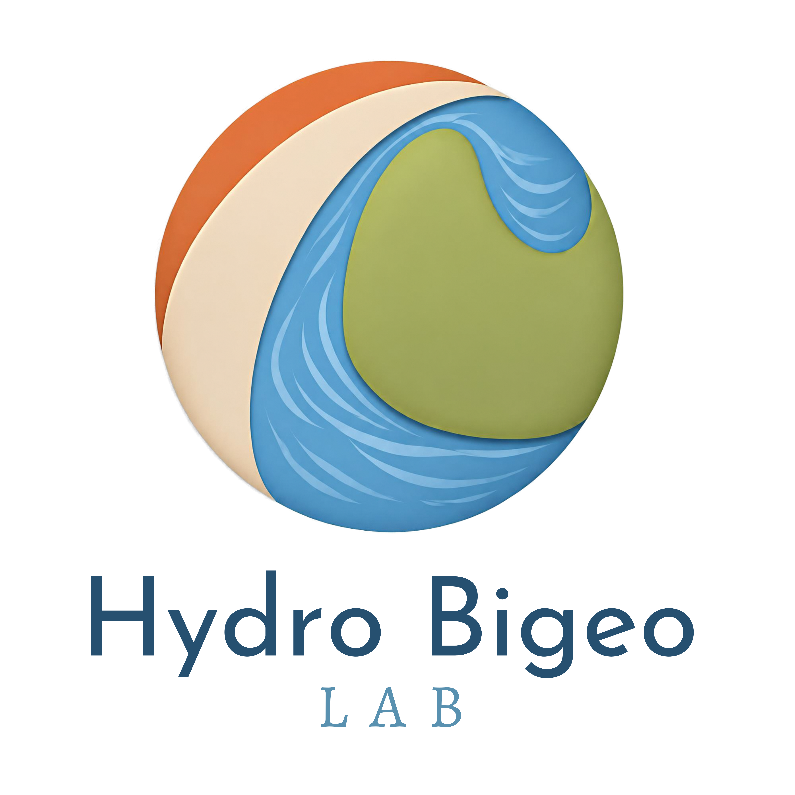
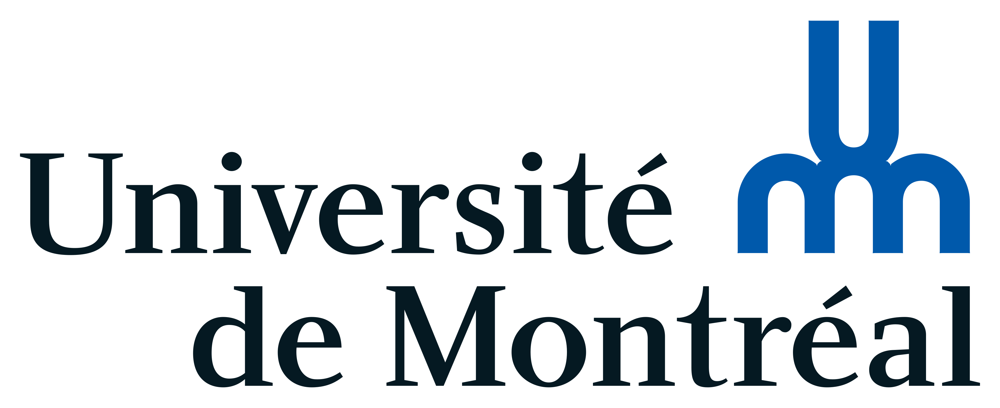

{fig-align="center" width="362"}

## Welcome

The Hydro Biogeo Lab is an interdisciplinary research group studying the hydrological component of global biogeochemical cycles. We want to better understand how land-water processes drive biogeochemical fluxes, their inner-workings and how they may respond to environmental changes.

Our research is based mostly on field observations and carried across multiple scales. We combine multiple tools including automated and continuous *in-situ* sensor measurements, isotopic tracers and geospatial data analysis.

We are based at the [departement of geography of University of Montréal](https://geographie.umontreal.ca/accueil/), located at Campus-MIL

{fig-align="center"}

{fig-align="right" width="236"}

## How to use this website

This websites serves as a **diffusion platform** for the research we do collectively in the lab.

Here, you will find:

- Tutorials and data viz material in the educational resources page.

- Individual portfolios from team members with more information on their research projects.

- A list of publications, field sites, tools and equipement that form the core basis of our work.

We hold strong beliefs in the importance of making our science and knowledge accessible.

All material featured here is licensed under the CC-XYZ common. Please use and share accordingly.

## Partners

Our research is supported by

{fig-align="center"}
